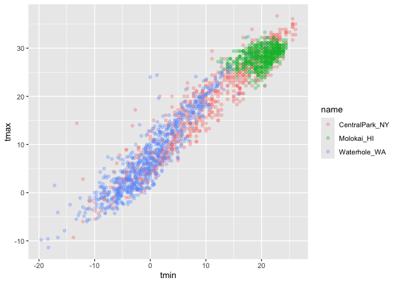
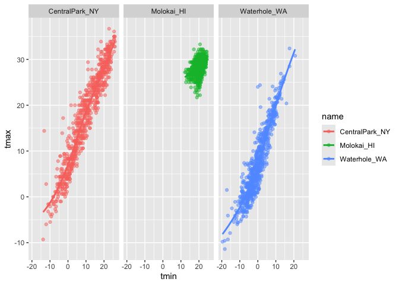

Vis I
================
Yunjia Liu
2024-09-26

``` r
weather_df = 
  rnoaa::meteo_pull_monitors(
    c("USW00094728", "USW00022534", "USS0023B17S"),
    var = c("PRCP", "TMIN", "TMAX"), 
    date_min = "2021-01-01",
    date_max = "2022-12-31") |>
  mutate(
    name = case_match(
      id, 
      "USW00094728" ~ "CentralPark_NY", 
      "USW00022534" ~ "Molokai_HI",
      "USS0023B17S" ~ "Waterhole_WA"),
    tmin = tmin / 10,
    tmax = tmax / 10) |>
  select(name, id, everything())
```

Making first plot.

``` r
ggplot(weather_df, aes(x = tmin, y = tmax)) +
  geom_point()
```

<!-- -->

``` r
gg_weather_scatterplot =
  weather_df |>
  ggplot(aes(x = tmin, y = tmax)) +
  geom_point()

gg_weather_scatterplot
```

<!-- -->

### make points more transparent and add color according to their names

``` r
weather_df |>
  ggplot(aes(x = tmin, y = tmax, colour = name)) + 
  geom_point(alpha = .3)
```

    ## Warning: Removed 17 rows containing missing values or values outside the scale range
    ## (`geom_point()`).

<!-- -->

``` r
ggplot(weather_df, aes(x = tmin, y = tmax)) + 
  geom_point(aes(color = name), alpha = .3, size = .8) +
  geom_smooth(se = FALSE)
```

    ## `geom_smooth()` using method = 'gam' and formula = 'y ~ s(x, bs = "cs")'

    ## Warning: Removed 17 rows containing non-finite outside the scale range
    ## (`stat_smooth()`).

    ## Warning: Removed 17 rows containing missing values or values outside the scale range
    ## (`geom_point()`).

<!-- -->

``` r
ggplot(weather_df, aes(x = tmin, y = tmax, color = name)) + 
  geom_point(alpha = .5) +
  geom_smooth(se = FALSE) + 
  facet_grid(. ~ name)
```

    ## `geom_smooth()` using method = 'loess' and formula = 'y ~ x'

    ## Warning: Removed 17 rows containing non-finite outside the scale range
    ## (`stat_smooth()`).

    ## Warning: Removed 17 rows containing missing values or values outside the scale range
    ## (`geom_point()`).

<!-- -->
