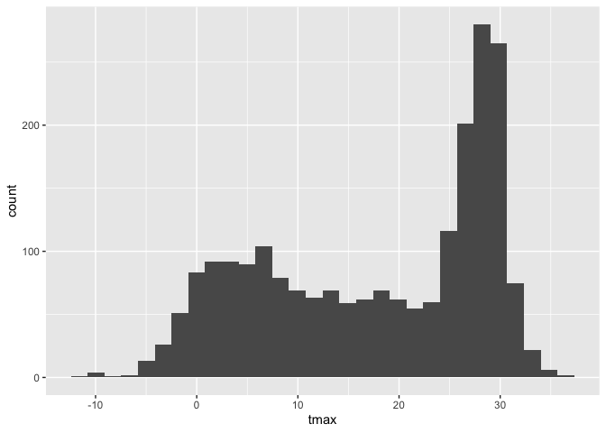
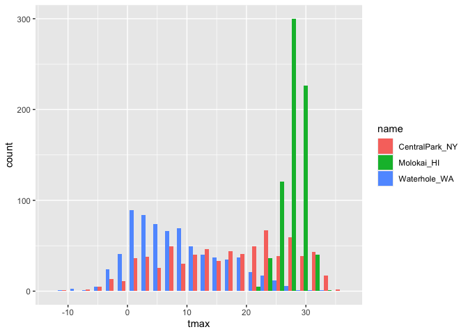
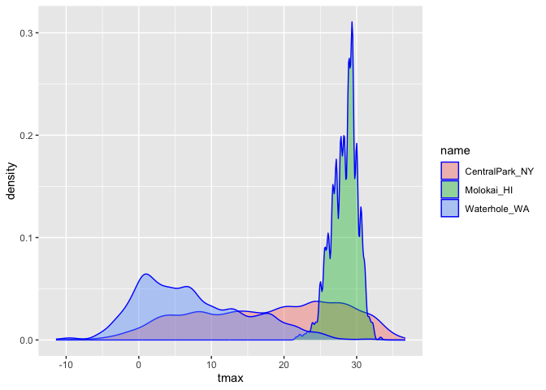

Vis I
================
Yunjia Liu
2024-09-26

``` r
weather_df = 
  rnoaa::meteo_pull_monitors(
    c("USW00094728", "USW00022534", "USS0023B17S"),
    var = c("PRCP", "TMIN", "TMAX"), 
    date_min = "2021-01-01",
    date_max = "2022-12-31") |>
  mutate(
    name = case_match(
      id, 
      "USW00094728" ~ "CentralPark_NY", 
      "USW00022534" ~ "Molokai_HI",
      "USS0023B17S" ~ "Waterhole_WA"),
    tmin = tmin / 10,
    tmax = tmax / 10) |>
  select(name, id, everything())
```

Making first plot.

``` r
ggplot(weather_df, aes(x = tmin, y = tmax)) +
  geom_point()
```

<!-- -->

``` r
gg_weather_scatterplot =
  weather_df |>
  ggplot(aes(x = tmin, y = tmax)) +
  geom_point()

gg_weather_scatterplot
```

<!-- -->

### make points more transparent and add color according to their names

``` r
weather_df |>
  ggplot(aes(x = tmin, y = tmax, colour = name)) + 
  geom_point(alpha = .3)
```

<!-- -->

``` r
ggplot(weather_df, aes(x = tmin, y = tmax)) + 
  geom_point(aes(color = name), alpha = .3, size = .8) +
  geom_smooth(se = FALSE)
```

    ## `geom_smooth()` using method = 'gam' and formula = 'y ~ s(x, bs = "cs")'

<!-- -->

``` r
ggplot(weather_df, aes(x = tmin, y = tmax, color = name)) + 
  geom_point(alpha = .5) +
  geom_smooth(se = FALSE) + 
  facet_grid(. ~ name)
```

    ## `geom_smooth()` using method = 'loess' and formula = 'y ~ x'

<!-- -->

``` r
ggplot(weather_df, aes(x = date, y = tmax, color = name)) + 
  geom_point(aes(size = prcp), alpha = .5) +
  geom_smooth(se = FALSE) + 
  facet_grid(. ~ name)
```

    ## `geom_smooth()` using method = 'loess' and formula = 'y ~ x'

    ## Warning: Removed 17 rows containing non-finite outside the scale range
    ## (`stat_smooth()`).

    ## Warning: Removed 19 rows containing missing values or values outside the scale range
    ## (`geom_point()`).

<!-- -->

``` r
weather_df |> 
  filter(name == "CentralPark_NY") |> 
  mutate(
    tmax_fahr = tmax * (9 / 5) + 32,
    tmin_fahr = tmin * (9 / 5) + 32) |> 
  ggplot(aes(x = tmin_fahr, y = tmax_fahr)) +
  geom_point(alpha = .5) + 
  geom_smooth(method = "lm", se = FALSE)
```

    ## `geom_smooth()` using formula = 'y ~ x'

<!-- -->

## Small things

``` r
weather_df |>
  ggplot(aes(x = tmin, y = tmax)) +
  geom_smooth(se = FALSE)
```

    ## `geom_smooth()` using method = 'gam' and formula = 'y ~ s(x, bs = "cs")'

    ## Warning: Removed 17 rows containing non-finite outside the scale range
    ## (`stat_smooth()`).

<!-- -->

``` r
weather_df |>
  ggplot(aes(x = tmin, y = tmax)) +
  geom_hex()
```

    ## Warning: Removed 17 rows containing non-finite outside the scale range
    ## (`stat_binhex()`).

<!-- -->

``` r
weather_df |>
  ggplot(aes(x = tmin, y = tmax)) +
  geom_point(color = "orange")
```

    ## Warning: Removed 17 rows containing missing values or values outside the scale range
    ## (`geom_point()`).

<!-- -->

## Univariate variants

### histogram

``` r
ggplot(weather_df, aes(x = tmax)) + 
  geom_histogram()
```

    ## `stat_bin()` using `bins = 30`. Pick better value with `binwidth`.

    ## Warning: Removed 17 rows containing non-finite outside the scale range
    ## (`stat_bin()`).

<!-- -->

``` r
ggplot(weather_df, aes(x = tmax, fill = name)) + 
  geom_histogram(position = "dodge", binwidth = 2)
```

    ## Warning: Removed 17 rows containing non-finite outside the scale range
    ## (`stat_bin()`).

<!-- -->

``` r
ggplot(weather_df, aes(x = tmax, fill = name)) + 
  geom_density(alpha = .4, adjust = .5, color = "blue")
```

    ## Warning: Removed 17 rows containing non-finite outside the scale range
    ## (`stat_density()`).

<!-- -->

## box plot

``` r
ggplot(weather_df, aes(x = name, y = tmax)) + 
  geom_boxplot()
```

    ## Warning: Removed 17 rows containing non-finite outside the scale range
    ## (`stat_boxplot()`).

<!-- -->

## violin plot

``` r
ggplot(weather_df, aes(x = name, y = tmax)) + 
  geom_violin(aes(fill = name), alpha = .5) + 
  stat_summary(fun = "median", color = "blue")
```

    ## Warning: Removed 17 rows containing non-finite outside the scale range
    ## (`stat_ydensity()`).

    ## Warning: Removed 17 rows containing non-finite outside the scale range
    ## (`stat_summary()`).

    ## Warning: Removed 3 rows containing missing values or values outside the scale range
    ## (`geom_segment()`).

<!-- -->

## ridges

``` r
ggplot(weather_df, aes(x = tmax, y = name)) + 
  geom_density_ridges(scale = .85)
```

    ## Picking joint bandwidth of 1.54

    ## Warning: Removed 17 rows containing non-finite outside the scale range
    ## (`stat_density_ridges()`).

<!-- -->

ˆ
